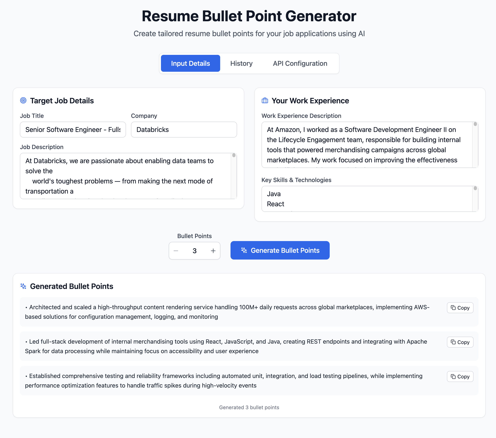

# Resume Bullet Point Generator



An LLM-powered web tool that creates tailored resume bullet points for job applications. This application helps job seekers generate professional, targeted bullet points based on their work experience and the specific job description they're applying for.

## Features

- **Smart Input Form**: Collect job details, company information, job description, and your work experience
- **Configurable Bullet Points**: Choose to generate 3-10 bullet points with a custom number input
- **AI-Powered Generation**: Uses LLM technology (Anthropic Claude or OpenAI GPT) to create relevant, tailored bullet points
- **Run History**: Save and reload previous generations with all inputs and outputs
- **Copy to Clipboard**: Easy one-click copying of individual bullet points or copy all at once from history
- **Professional UI**: Clean, modern interface with tabbed navigation (Input Details, History, API Configuration)
- **Secure API Storage**: Client-side encrypted storage of API configurations
- **Responsive Design**: Works seamlessly on desktop and mobile devices

## Input Fields

The application collects the following information to generate tailored bullet points:

1. **Job Title** - The position you're applying for
2. **Company** - The company you're applying to
3. **Job Description** - The full job posting description
4. **Work Experience** - Your relevant work experience and achievements
5. **Skills & Technologies** - Your technical skills and tools
6. **Bullet Point Count** - Choose to generate 3-10 bullet points (default: 5)

## Getting Started

### Prerequisites

- Node.js (version 16 or higher)
- npm or yarn package manager

### Installation

1. Clone the repository:
```bash
git clone <repository-url>
cd resume-bullet-point-generator
```

2. Install dependencies:
```bash
npm install
```

3. Start the development server:
```bash
npm run dev
```

4. Open your browser and navigate to `http://localhost:3000`

### API Configuration

The application supports both Anthropic (Claude) and OpenAI APIs:

- **Anthropic Claude**: Direct browser access with `anthropic-dangerous-direct-browser-access` header
- **OpenAI GPT**: Direct API calls with proper CORS handling

Configure your API keys in the "API Configuration" tab. The app securely stores your configuration client-side with encryption.

### Building for Production

```bash
npm run build
```

## Technology Stack

- **Frontend**: React 18 with TypeScript
- **Styling**: Tailwind CSS with custom component classes
- **Build Tool**: Vite
- **Icons**: Lucide React
- **State Management**: React Hooks
- **AI Services**: Anthropic Claude API, OpenAI GPT API
- **Storage**: LocalStorage with client-side encryption
- **UI Components**: Custom reusable components with TypeScript interfaces

## Project Structure

```
src/
├── App.tsx                    # Main application component
├── main.tsx                   # Application entry point
├── index.css                  # Global styles and Tailwind imports
├── components/                # Reusable UI components
│   ├── APISetup.tsx          # API configuration interface
│   ├── BulletPointItem.tsx   # Individual bullet point display
│   ├── BulletPointsOutput.tsx # Generated results display
│   ├── GenerateButton.tsx    # Generation trigger with number input
│   ├── Header.tsx            # Application header
│   ├── HistoryItem.tsx       # History item display
│   ├── InputForm.tsx         # Main input form container
│   ├── JobDetailsForm.tsx    # Job details input section
│   ├── NumberInput.tsx       # Custom number input component
│   ├── RunHistory.tsx        # History management
│   ├── TabNavigation.tsx     # Tab navigation component
│   └── WorkExperienceForm.tsx # Work experience input section
├── services/                  # API and data services
│   ├── anthropic.ts          # Anthropic API service
│   ├── history.ts            # History management service
│   ├── openai.ts             # OpenAI API service
│   ├── proxy.ts              # Main service orchestrator
│   └── storage.ts            # Secure storage service
├── types/                     # TypeScript type definitions
│   ├── api.ts               # API request/response types
│   ├── history.ts           # History data types
│   └── services.ts          # Service interface types
├── utils/                     # Utility functions
│   ├── prompts.ts           # AI prompt generation
│   └── utils.ts             # General utilities
└── lib/
    └── utils.ts             # Tailwind utility functions
```

## Usage

1. **Configure API**: Set up your Anthropic or OpenAI API key in the "API Configuration" tab
2. **Fill out the form**: Enter the job details and your work experience in the "Input Details" tab
3. **Set bullet point count**: Use the number input to choose how many bullet points to generate (3-10)
4. **Generate bullet points**: Click the "Generate Bullet Points" button
5. **Review and copy**: Browse through the generated bullet points and copy individual ones or copy all at once
6. **Access history**: View and reload previous generations in the "History" tab
7. **Customize**: Edit your inputs and regenerate if needed

## Future Enhancements

- Integration with other LLM APIs beyond OpenAI and Anthropic
- Export to different resume formats (PDF, Word, etc.)
- A/B testing different bullet point styles
- Industry-specific templates and prompts
- Resume scoring and optimization suggestions
- Bulk generation for multiple job applications
- Advanced prompt customization options
- Integration with job board APIs

## Contributing

1. Fork the repository
2. Create a feature branch
3. Make your changes
4. Add tests if applicable
5. Submit a pull request

## License

This project is licensed under the MIT License.

## Support

For questions or support, please open an issue in the repository. 